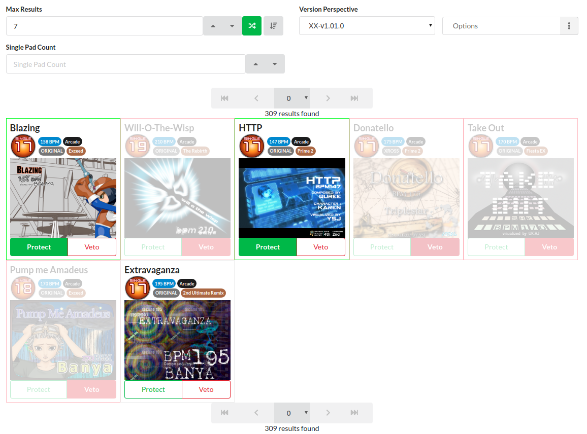
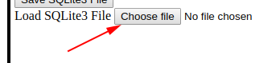
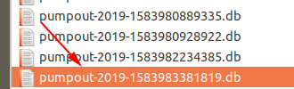
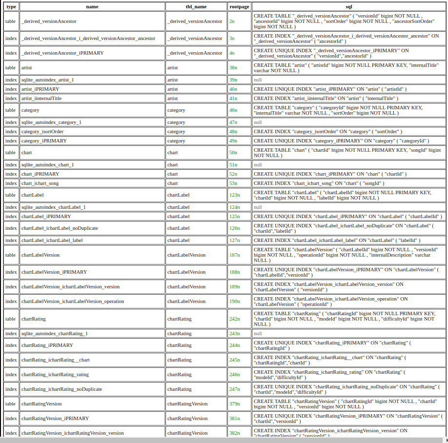

### Pump Out SQLite3 Dump

This repository will contain periodic dumps of the [Pump Out](https://pumpout2.anyhowstep.com:17593/) website's entire database.

Each file is a [SQLite3](https://www.sqlite.org/index.html) database file.

Each file will have the following naming convention,
`pumpout-yyyy-MM-dd-HH-mm-unixTimestampInMilliseconds.db`

You may find the dumps in the [dump](dump) directory.

-----

### Who

At the moment, Pump Out is mainly maintained and hosted by [AnyhowStep](https://github.com/AnyhowStep).

However, almost all of the data entry is now done by [Haru-kaze](https://twitter.com/pticakiwi).

Various members of the Pump community frequently contribute by providing information, making bug reports, making feature requests, etc.

-----

### What

Pump Out is a utility tool for the music game [Pump it Up](https://en.wikipedia.org/wiki/Pump_It_Up_(video_game_series)).

Its core feature is an [advanced search tool](https://pumpout2.anyhowstep.com:17593/search) (Which I'll admit does not have the best UI/UX).

Almost every other feature uses the search tool in some way.

It can be used to look for trivia about the game.

More seriously, it can be used to randomize charts for personal training, or for tournaments.



-----

### When

Pump Out was started around 2013, when I wanted a tool to,

+ Recommend songs/charts for me to play.
+ Keep track of random Pump trivia. (Internal IDs, Stepmakers, etc.)

Many features have come and gone, over the years.
However, **searching** will always stay.

-----

### Why

As **searching** is so important to Pump Out, why release a complete dump of its database?

Others can now come in, take the data, make a better search tool, claim the dataset as their own,
and push Pump Out into obscurity. Right?

-----

Well, probably, yes. **But that wouldn't be a bad thing.**
If that happened, the entire Pump community would gain a better search tool!

The **most difficult** part about creating a tool for a music game is the sheer amount of data that's needed,
for it to even be remotely useful.

If you don't have information about the latest patch, your tool is **immediately** useless
for people that need to use it with the latest version of the game.

Especially in a tournament setting. In these cases, even a bowl of paper strips, with songs and charts written on them, would work better than a tool that is missing data!

Many other similar tools have fallen into obscurity, simply because the developers
got tired of the relentless manual data entry needed to keep up with the patches.

-----

If **some group** can provide up-to-date information about the game,
within reasonable time frames, it can ease the burden of manual data entry for many other developers.

-----

I am one person, and I have many other projects I wish to pursue.
I also have the development speed of one person.
And there are many, many features that Pump Out lacks.

If this data dump can inspire 10 other people to write tools to fill in these gaps,
**every Pump player wins**.

-----

I have discussed this with various people over the years, talking about open-sourcing Pump Out in one form or the other.

I still have not open-sourced the entirety of Pump Out.
However, releasing this data dump and promising to provide periodic updates is the very first step in that direction.

It is also probably the step that has the potential to make the biggest impact, out of everything Pump Out has to offer.

-----

### How

The data dumps will be made by extracting the [information schema](https://en.wikipedia.org/wiki/Information_schema) and data of Pump Out's MySQL database, and replicating it onto a SQLite database file.

And that's the easy part, which takes less than a minute.

-----

The time-consuming part is Haru-kaze, myself, and other contributors collecting information about the patches as they are released, and performing manual data entry. This process may take days (or even weeks?).

-----

### Installation and Usage

Any program that can read a SQLite3 database file is fair game!

Just download the latest data dump and use the program to open it!

If you want to look at the database without downloading a program,
you may use this Playground I built for a different project,

https://anyhowstep.github.io/tsql-sqlite3-browser/test-playground/public/

First, click on "Choose File" (excuse the ugly UI).



Then, select the file to open.



You should see a `SELECT * FROM sqlite_master;` query execute.



Finally, you can start executing SQL queries,
```sql
SELECT
    *
FROM
    song
WHERE
    EXISTS(
        SELECT
            *
        FROM
            songArtist
        WHERE
            songArtist.songId = song.songId AND
            songArtist.artistId IN (
            SELECt
                    artistId
                FROM
                    artist
                WHERE
                    internalTitle LIKE 'SHK'
        )
    );
```

-----

### Issues and Support

Just create an issue if you need help or support in any way.

Need the latest patch data asap for a tournament happening this weekend?
Create an issue.

Patch data taking too long to update?
Create an issue.

Found a mistake in the data?
Create an issue.

Got data you would like to contribute?
Create an issue.

-----

### TODO

These will be created as separate issues soon, but here are some TODOs for now,

+ ERD for the database

  This would make understanding the database schema easier.
  Right now, the schema is pretty complex to flexibly support many of Pump's data quirks.

+ Consider adding FKs to the dumps

  FKs exist on the MySQL database but FKs aren't really necessary for read-only dumps.
  However, FKs may also aid in understanding the database schema.

+ In-depth documentation about the schema

  ERDs and FKs may not be enough to understand the rationale behind some design decisions.

+ Consider a more permissive license?

  CC BY-NC-SA 4.0 is the current license.

-----

### License

This work is licensed under the Creative Commons Attribution-NonCommercial-ShareAlike 4.0 International License. To view a copy of this license, visit http://creativecommons.org/licenses/by-nc-sa/4.0/ or send a letter to Creative Commons, PO Box 1866, Mountain View, CA 94042, USA.

-----

You are free to share and adapt the material, as outlined in the license.

Please provide attribution by providing a link to [this repository](https://github.com/AnyhowStep/pump-out-sqlite3-dump).

You may not use the data for commercial purposes; Pump players don't have money because they spent it all on Pump 💸

If you build upon the data set, it must be relased under the same license.
